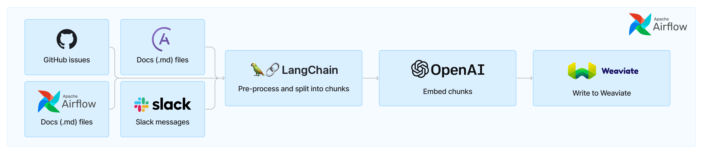
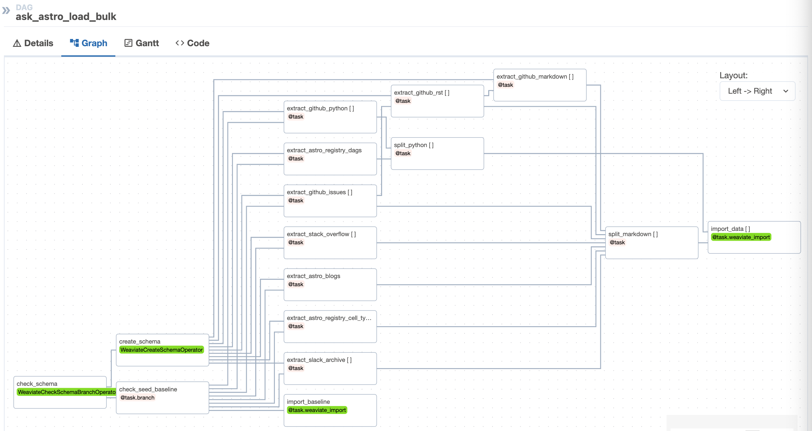

<br />

<p align="center">
  
</p>

<br />

Ask Astro is an open-source reference implementation of [Andreessen Horowitz's LLM Application Architecture](https://a16z.com/emerging-architectures-for-llm-applications/) built by [Astronomer](https://astronomer.io). It provides an end-to-end example of a Q&A LLM application used to answer questions about Apache Airflow and Astronomer, including:

## Ingest and Embedding
In order to make the responses as factual and accurate as possible, Ask Astro uses [Retrieval Augmented Generation (RAG)](https://proceedings.neurips.cc/paper/2020/hash/6b493230205f780e1bc26945df7481e5-Abstract.html). The following setup procedures can be followed to ingest and embed documents for RAG with Apache Airflow and Astro.

Ask Astro uses a set of Airflow DAGs that: ingest data from a source via an API or Python library, preprocesses and splits the data into smaller chunks, embeds those chunks, and writes the embeddings to Weaviate. As of today, Ask Astro retrieves data from the following sources:

- [Apache Airflow docs](https://airflow.apache.org/docs/)
- [Astronomer docs](https://docs.astronomer.io)
- [Astronomer blog](https://www.astronomer.io/blog/)
- [Astronomer Registry](https://registry.astronomer.io)
- [Apache Airflow GitHub](https://github.com/apache/airflow) issues and pull requests
- [OpenLineage GitHub](https://github.com/OpenLineage/OpenLineage)
- [OpenLineage GitHub docs](https://github.com/OpenLineage/docs)
- Apache Airflow Slack's [#troubleshooting channel](https://app.slack.com/client/TCQ18L22Z/CCQ7EGB1P)
- [StackOverflow's Stack Exchange Data Dump](https://archive.org/details/stackexchange)

Generally, each of these sources has a DAG that handles the ingestion flow. We use LangChain's built-in text splitters for processing Markdown, RST, and Python code into smaller chunks to ensure each document is small enough to give accurate results when doing embeddings. We then use a Weaviate provider that we've built (and plan to publish) to both embed and store each document as a vector in Weaviate using OpenAI's embedding model.

In addition to the individual DAGs per source, we have one DAG to do full-database refresh based on a baseline of all data. The first time the `ask-astro-load-bulk` DAG runs it saves extracted documents in parquet files for a point-in-time baseline.  This baseline allows us to experiment with new vector databases, embedding models, chunking strategies, etc. much more quickly.

Additionally, a baseline of pre-embedded data provides the ability to ingest a stable baseline for upstream evaluation.  See step 5 below.

<p align="center">
  
</p>

## Prerequisites
There are many options for LLMs and vector databases. This template currently uses Microsoft Azure OpenAI for the LLMs and Weaviate vector database.
- Docker Desktop or similar Docker services running locally with the docker CLI installed.
- [OpenAI account](https://platform.openai.com/signup) (optional)
- [Astronomer account](https://www.astronomer.io/try-astro/) (optional)
- [Weaviate account](https://console.weaviate.cloud/) (optional)

## Setup

1. Install Astronomer's [Astro CLI](https://github.com/astronomer/astro-cli).  The Astro CLI is an Apache 2.0 licensed, open-source tool for building Airflow instances and is the fastest and easiest way to be up and running with Airflow in minutes. The Astro CLI is a Docker Compose-based tool and also integrates easily with Weaviate for a local developer environment. Open a terminal window and run:

For MacOS
```bash
brew install astro
```

For Linux
```bash
curl -sSL install.astronomer.io | sudo bash -s
```

2. Clone this repository:
```bash
git clone https://github.com/astronomer/ask-astro
cd ask-astro
```

3. Create a file called `airflow/.env` with the following connection strings and environment variables.
- `ASK_ASTRO_ENV`: This is an environment variable that allows us to switch easily between local development and hosted test/prod instances.
Example:
```
ASK_ASTRO_ENV='local'
```
- `AIRFLOW_CONN_GITHUB_RO`: Add a github [personal access token](https://docs.github.com/en/authentication/keeping-your-account-and-data-secure/managing-your-personal-access-tokens).  The token needs NO PRIVILEGES for the example DAGs since it is reading from public repos.  If adding another private repo use a token with read privileges for that repo.
Example:
```
AIRFLOW_CONN_GITHUB_RO='{"conn_type": "github", "password": "ghp_xxxxxxxxxxxxxx"}'
```
- `AIRFLOW_CONN_WEAVIATE_LOCAL`: Add OpenAI keys to be used during embedding ingest and for data query.
  -- `X-Azure-Api-Key`: Specify for OpenAI endpoints with Microsoft Azure.
  -- `X-OpenAI-Api-Key`: Specify for public OpenAI endpoints.
Example:
```
AIRFLOW_CONN_WEAVIATE_LOCAL='{"conn_type": "weaviate", "host": "http://weaviate:8081", "extra": {"X-OpenAI-Api-Key": "sk-xxxxxxx"}}'
```

- `AIRFLOW_CONN_SLACK_API_RO`: Optionally add a Slack token for reading slack messages from the desired slack channel.  This is not needed for the bulk ingest of Airflow `troubleshooting` channel as a baseline from slack archives is used.

4.  Update the schema: The template includes a single document class called `Docs`.  This is for simplicity of the reference architecture and, even with a simple schema, Ask Astro performs very well.  When building a new usecase from the reference architecture it will likely be necessary to optimize the schema for the specific document types and use-case.

The Weaviate schema specifies LLM models to use for [embedding](https://weaviate.io/developers/weaviate/modules/retriever-vectorizer-modules/text2vec-openai).  This repo provides a sample schema in the `airflow/include/data/schema.json` file based on OpenAI endpoints.

For Microsoft Azure OpenAI endpoints edit the schema file and change the `text2vec-openai` module settings to following with your specific `resourceName` and `deploymentId`:
```yaml
"text2vec-openai": {
  "resourceName": "xxxxxxxxxxxx",
  "deploymentId": "xxxxxxxxxxxx",
  "vectorizeClassName": "False"
},
```

For the basic functionality of ingest and embedding a [vectorizer module](https://weaviate.io/developers/weaviate/modules/retriever-vectorizer-modules#vectorization-with-text2vec--modules) is the only requirement.  The Streamlit application will use the OpenAI key for [generative search](https://weaviate.io/developers/weaviate/modules/reader-generator-modules/generative-openai) and [Q&A](https://weaviate.io/developers/weaviate/modules/reader-generator-modules/qna-openai).

5.  (Optional) Use pre-embedded baseline:  The `ask_astro_load_bulk` DAG has been configured to optionally use a seeded baseline of pre-embedded data.  This is useful for RAG evaluation purposes.  To ingest from the seeded baseline:
- Open the file `include/dags/ask_astro_load.py`
- Set the `seed_baseline` variable to 'https://astronomer-demos-public-readonly.s3.us-west-2.amazonaws.com/ask-astro/baseline_data_v2.parquet'
- Save the file

6.  Start Apache Airflow and Weaviate
```sh
cd airflow
astro dev start
```
The Astro CLI uses Docker Compose to instantiate a local containerized instance of Airflow.  Weaviate also provides a containerized version for local development which integrates easily with Astro.  See the weaviate section in the file `airflow/include/docker-compose.override.yml` for details.

After Airflow starts a browser window should open to [http://localhost:8080](http://localhost:8080)
Login with
- username: `admin`
- password: `admin`

7. Run the `ask_astro_load_bulk` DAG
```bash
astro dev run dags unpause ask_astro_load_bulk
astro dev run dags trigger ask_astro_load_bulk
```
Due to the number of document sources and API rate limits some of the tasks need to run serially or with multiple retries.  The first time the DAG runs it can take ~25min for the extract and split.  These extracted documents are serialized and subsequent runs will be much faster.

Follow the status of the DAG run in the [Airflow UI](http://localhost:8080/dags/ask_astro_load_bulk/grid) (username: `admin`, password: `admin`)

8. Open the [Weaviate console](https://link.weaviate.io/48TqGKz) to query the local instance.

9.  Incremental ingest DAGs have been created for each data source type and are designed to run periodically (nightly) to ingest new documents since the bulk ingest.  These DAGs use the same logic as the bulk ingest for 'extraction' (see `airflow/include/tasks/extract.py`), document splitting (see `airflow/include/tasks/split.py`) and ingestion (see `airflow/include/tasks/ingest.py`).

Unpause these DAGs to see how they ingest and upsert any documents that have changed.  If running these DAGs directly after the bulk ingest there will be very few documents to update.  Look at the logs for the `import_data` tasks to see that ingestion of most documents is 'skipped'.

10. Update the DAGs with other sources.
- The Airflow ingest DAGs use [dynamic tasks](https://docs.astronomer.io/learn/dynamic-tasks) to iterate over multiple document sources.  For instance, the bulk ingest DAG (`airflow/include/dags/ingest/ask-astro-load.py`) specifies markdown sources in github repositories.
```python
markdown_docs_sources = [
    {'doc_dir': 'learn', 'repo_base': 'astronomer/docs'},
    {'doc_dir': 'astro', 'repo_base': 'astronomer/docs'},
  ]
```

To ingest markdown documents from additional repositories simply add the source and re-run the DAG.
```python
markdown_docs_sources = [
    {'doc_dir': 'learn', 'repo_base': 'astronomer/docs'},
    {'doc_dir': 'astro', 'repo_base': 'astronomer/docs'},
    {'doc_dir': 'base', 'repo_base': 'OpenLineage/docs'},
    {'doc_dir': 'base', 'repo_base': 'OpenLineage/OpenLineage'}
  ]
```

- The 'extract' logic for each data source is specified in `airflow/include/tasks/extract.py`.  These functions can be copied/pasted to select new sources.
For instance, the `extract_astro_blogs` function shows an example of using the Python [requests](https://pypi.org/project/requests/) and [Beautiful Soup](https://pypi.org/project/beautifulsoup4/) libraries to extract blog posts from http://astronomer.io/blog.  This code can be adapted to ingeset from other sources.

11. Ingest to Test: A free Weaviate Sandbox cluster can be created with a trial account. The sandbox is a free 14-day temporary cluster. After creating the sandbox cluster note the `Cluster URL` and the Admin API Key.
- Open the `airflow/.env` file and update the following:
-- `ASK_ASTRO_ENV`: Set it to `test`
-- `AIRFLOW_CONN_WEAVIATE_TEST`: Update the host and token with the sandbox settings.  The OpenAI key should be the same as in the 'local' setting.
- Restart astro with the new environment variables.
```bash
astro dev restart
```
- Rerun the bulk ingest DAG
```bash
astro dev run dags unpause ask_astro_load_bulk
astro dev run dags trigger ask_astro_load_bulk
```

This time when the DAG runs it will use the serialized extracted documents which will run much faster.  Only the `import_data` tasks will take time.  Look in the task logs for this task to note that it is now using the 'test' cluster.  For example:
```
[2023-10-17, 12:26:21 UTC] {base.py:73} INFO - Using connection ID 'weaviate_test' for task execution.
```

As the DAG runs you can see the document count increasing in the [Weaviate Console](https://console.weaviate.cloud) with a query such as:
```
{ Aggregate { Docs { meta { count } } } }
```

After integration testing with the front end the sandbox cluster can be removed.

12. Promote to production: Step 10 showed an example of switching between different Weaviate instances.  Follow the same approach to point Airflow at a 'production' (ie. non-temporary sandbox).  Perform the following to promote from Airflow running locally to a production deployment in Astro.
- Create a free [Astro trial](https://docs.astronomer.io/astro/trial) account, organization and deployment.
- [Deploy](https://docs.astronomer.io/astro/deploy-code) the Astro project
```bash
astro login
```
```bash
astro deployment create -n 'ask astro dev'
astro deployment variable update -lsn 'ask astro dev'
astro deployment variable update -n 'ask astro dev' ASK_ASTRO_ENV=dev
astro deploy -fn 'ask astro dev'
```

13. Query the Data: A simple Streamlit application is provided to query the data.  For this application you will have needed to provide an OpenAI key with the Weaviate connection string in step 3.

- Connect to the webserver container with the Astro CLI
```bash
astro dev bash -w
```

- Start Streamlit
```bash
cd include/streamlit
python -m streamlit run ./streamlit_app.py
```

## Feedback
Give us your feedback, comments and ideas at https://github.com/astronomer/ask-astro/discussions
