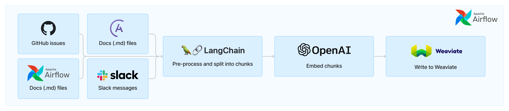
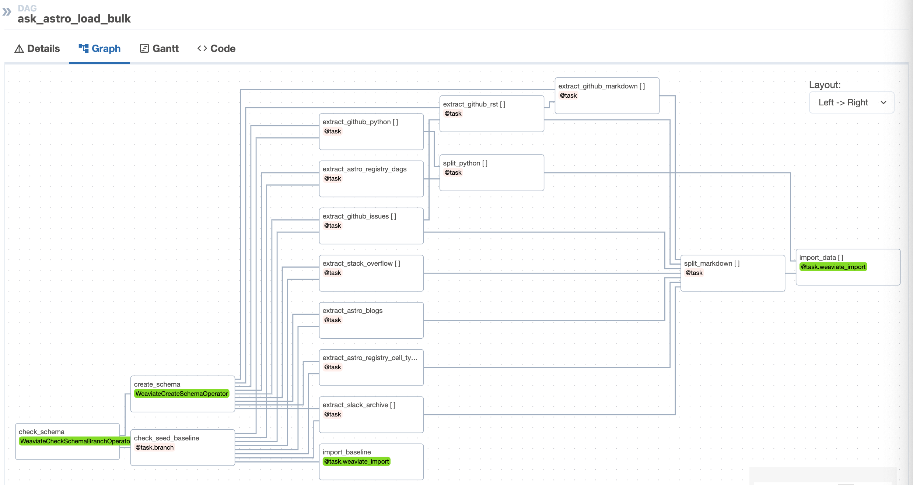

<br />

<p align="center">
  
</p>

<br />

# ask-astro Apache Airflow®

Ask Astro is an open-source reference implementation of [Andreessen Horowitz's LLM Application Architecture](https://a16z.com/emerging-architectures-for-llm-applications/) built by [Astronomer](https://astronomer.io). It provides an end-to-end example of a Q&A LLM application used to answer questions about Apache Airflow® and Astronomer.

## Ingest and Embedding
In order to make the responses as factual and accurate as possible, Ask Astro uses [Retrieval Augmented Generation (RAG)](https://proceedings.neurips.cc/paper/2020/hash/6b493230205f780e1bc26945df7481e5-Abstract.html). Use the following setup procedures to ingest and embed documents for RAG with Apache Airflow and Astro.

Ask Astro uses a set of Airflow DAGs that ingests data from a source via an API or Python library, preprocesses and splits the data into smaller chunks, embeds those chunks, and writes the embeddings to Weaviate. Ask Astro retrieves data from the following sources:

- [Apache Airflow® docs](https://airflow.apache.org/docs/)
- [Astronomer docs](https://docs.astronomer.io)
- [Astronomer blog](https://www.astronomer.io/blog/)
- [Astronomer Registry](https://registry.astronomer.io)
- [Apache Airflow® GitHub](https://github.com/apache/airflow) issues and pull requests
- [OpenLineage GitHub](https://github.com/OpenLineage/OpenLineage)
- [OpenLineage GitHub docs](https://github.com/OpenLineage/docs)
- Apache Airflow® Slack's [#troubleshooting channel](https://app.slack.com/client/TCQ18L22Z/CCQ7EGB1P)
- [StackOverflow's Stack Exchange Data Dump](https://archive.org/details/stackexchange)
- [astro-cli](https://docs.astronomer.io/astro/cli/overview)

Generally, each of these sources has a DAG that handles the ingestion flow. Ask Astro uses LangChain's built-in text splitters for processing Markdown, RST, and Python code into smaller chunks to ensure each document is small enough to give accurate results when embedding. Ask Astro then uses a custom-built a Weaviate provider, that will be published later, to both embed and store each document as a vector in Weaviate using OpenAI's embedding model.

In addition to the individual DAGs per source, Ask Astro uses one DAG to do full-database refresh based on a baseline of all extracted data sources. The first time the `ask-astro-load-bulk` DAG runs, it saves extracted documents in parquet files for a point-in-time baseline. This baseline allows us to experiment with new vector databases, embedding models, chunking strategies, much more quickly than without a baseline to compare new versions against.

Additionally, a baseline of pre-embedded data provides the ability to ingest a stable baseline for upstream evaluation, which is described in Step 5 of the following procedure.

<p align="center">
  
</p>

## Prerequisites
There are many options for LLMs and vector databases. This template currently uses Microsoft Azure OpenAI for the LLMs and Weaviate vector database. To use this template you need the following:

- Docker Desktop or similar Docker services running locally with the docker CLI installed.
- [OpenAI account](https://platform.openai.com/signup) (optional)
- [Astronomer account](https://www.astronomer.io/try-astro/) (optional)
- [Weaviate account](https://console.weaviate.cloud/) (optional)

## Setup

1. Install Astronomer's [Astro CLI](https://github.com/astronomer/astro-cli). The Astro CLI is an Apache 2.0 licensed, open-source tool for building Airflow instances and provides the fastest and easiest way to be up and running with Airflow in minutes. The Astro CLI is a Docker Compose-based tool and integrates easily with Weaviate for a local developer environment.

To install the Astro CLI, open a terminal window and run:

  For MacOS
  ```bash
  brew install astro
  ```

  For Linux
  ```bash
  curl -sSL install.astronomer.io | sudo bash -s
  ```

2. Clone this repository:
  ```bash
  git clone https://github.com/astronomer/ask-astro
  cd ask-astro
  ```

3. Create a file called `airflow/.env` with the following connection strings and environment variables.
  - `ASK_ASTRO_ENV`: This environment variable tallows you to switch easily between local development and hosted test/prod instances For example:
    ```
    ASK_ASTRO_ENV='local'
    ```

  - `AIRFLOW_CONN_GITHUB_RO`: Add a github [personal access token](https://docs.github.com/en/authentication/keeping-your-account-and-data-secure/managing-your-personal-access-tokens). The token needs NO PRIVILEGES for the example DAGs since it reads from public repos. If you add another private repo, use a token with read privileges for that repo.
    Example:
    ```
    AIRFLOW_CONN_GITHUB_RO='{"conn_type": "github", "password": "ghp_xxxxxxxxxxxxxx"}'
    ```

  - `AIRFLOW_CONN_WEAVIATE_LOCAL`: Add OpenAI keys for embedding ingest and for data query.
    -- `X-Azure-Api-Key`: Specify for OpenAI endpoints with Microsoft Azure.
    -- `X-OpenAI-Api-Key`: Specify for public OpenAI endpoints.
    Example:
    ```
    AIRFLOW_CONN_WEAVIATE_LOCAL='{"conn_type": "weaviate", "host": "http://weaviate:8081", "extra": {"X-OpenAI-Api-Key": "sk-xxxxxxx"}}'
    ```

  - `AIRFLOW_CONN_SLACK_API_RO`: (Optional) Add a Slack token for reading Slack messages from the desired channel. You don't need a Slack token for the bulk ingest of the Airflow `troubleshooting` channel, because a baseline from Slack archives is used.

4. **Update the schema**: The template includes a single document class called `Docs`. This is to simplify the reference architecture and, even with a simple schema, Ask Astro performs very well. When building a new use case from the reference architecture, it is likely  necessary to optimize the schema for the specific document types and use case.

The Weaviate schema specifies LLM models to use for [embedding](https://weaviate.io/developers/weaviate/modules/retriever-vectorizer-modules/text2vec-openai). This repo provides a sample schema in the `airflow/include/data/schema.json` file based on OpenAI endpoints.

For Microsoft Azure OpenAI endpoints, edit the schema file and change the `text2vec-openai` module settings to the following. Use your specific `resourceName` and `deploymentId`:

```json
"text2vec-openai": {
  "resourceName": "xxxxxxxxxxxx",
  "deploymentId": "xxxxxxxxxxxx",
  "vectorizeClassName": "False"
},
```

Basic functionality of ingest and embedding only requires a [vectorizer module](https://weaviate.io/developers/weaviate/modules/retriever-vectorizer-modules#vectorization-with-text2vec--modules). The Streamlit application will use the OpenAI key for [generative search](https://weaviate.io/developers/weaviate/modules/reader-generator-modules/generative-openai) and [Q&A](https://weaviate.io/developers/weaviate/modules/reader-generator-modules/qna-openai).

5. (Optional) Use pre-embedded baseline: The `ask_astro_load_bulk` DAG optionally uses a seeded baseline of pre-embedded data for RAG evaluation purposes. To ingest from the seeded baseline:
- Open the file `include/dags/ask_astro_load.py`
- Set the `seed_baseline` variable to `https://astronomer-demos-public-readonly.s3.us-west-2.amazonaws.com/ask-astro/baseline_data_v2.parquet`
- Save the file

6. Start Apache Airflow and Weaviate
```sh
cd airflow
astro dev start
```
The Astro CLI uses Docker Compose to instantiate a local containerized instance of Airflow. Weaviate also provides a containerized version for local development, which integrates easily with Astro. See the Weaviate section in the file `airflow/include/docker-compose.override.yml` for details.

After Airflow starts a browser window that should open to [http://localhost:8080](http://localhost:8080). Log in with the following credentials:
- **username**: `admin`
- **password**: `admin`

7. Run the `ask_astro_load_bulk` DAG:
```bash
astro dev run dags unpause ask_astro_load_bulk
astro dev run dags trigger ask_astro_load_bulk
```
Due to the number of document sources and API rate limits some of the tasks need to run serially or with multiple retries, the first time the DAG runs it can take ~25min for the extract and split steps. These extracted documents are serialized during the first process, and subsequent runs finish faster.

Follow the status of the DAG run in the [Airflow UI](http://localhost:8080/dags/ask_astro_load_bulk/grid), which you can access with the same credentials. (username: `admin`, password: `admin`)

8. Open the [Weaviate console](https://link.weaviate.io/48TqGKz) to query the local instance.

9. The template includes incremental ingest DAGs for each data source type. These DAGs run periodically (nightly) to ingest new documents after the bulk ingest. These DAGs use the same logic as the bulk ingest for extraction (see `airflow/include/tasks/extract.py`), document splitting (see `airflow/include/tasks/split.py`), and ingestion (see `airflow/include/tasks/ingest.py`).

Unpause the incremental ingest DAGs to see how they ingest and upsert any documents that have changed. If you manually run these DAGs directly after the bulk ingest, it is unlikely that many documents have changed, and there won't be many updates. In this scenario, when you look at the logs for the `import_data` tasks, you see that ingestion of most documents is **Skipped**.

10. Update the DAGs with other sources.
- The Airflow ingest DAGs use [dynamic tasks](https://docs.astronomer.io/learn/dynamic-tasks) to iterate over multiple document sources. For example, the bulk ingest DAG, `airflow/include/dags/ingest/ask-astro-load.py`, specifies markdown sources in GitHub repositories.
```python
markdown_docs_sources = [
    {"doc_dir": "learn", "repo_base": "astronomer/docs"},
    {"doc_dir": "astro", "repo_base": "astronomer/docs"},
]
```

To ingest markdown documents from additional repositories, add the source and re-run the DAG.
```python
markdown_docs_sources = [
    {"doc_dir": "learn", "repo_base": "astronomer/docs"},
    {"doc_dir": "astro", "repo_base": "astronomer/docs"},
    {"doc_dir": "base", "repo_base": "OpenLineage/docs"},
    {"doc_dir": "base", "repo_base": "OpenLineage/OpenLineage"},
]
```

- The extract logic for each data source is specified in `airflow/include/tasks/extract.py`.  You can copy and paste these functions to select new sources.
For example, the `extract_astro_blogs` function shows how to use Python [requests](https://pypi.org/project/requests/) and [Beautiful Soup](https://pypi.org/project/beautifulsoup4/) libraries to extract blog posts from http://astronomer.io/blog. You can adapt this code to ingeset from other sources.

11. Ingest to Test: You can make a free Weaviate Sandbox cluster with a trial account. The sandbox provides a free 14-day temporary cluster. After creating the sandbox cluster, note the **Cluster URL** and the **Admin API Key**.
- Open the `airflow/.env` file and update the following:
-- `ASK_ASTRO_ENV`: Set it to `test`
-- `AIRFLOW_CONN_WEAVIATE_TEST`: Update the host and token with the sandbox **Cluster URL** and the **Admin API Key**. The OpenAI key should be the same as in the **local** setting.
- Restart Astro with the new environment variables.
```bash
astro dev restart
```
- Rerun the bulk ingest DAG
```bash
astro dev run dags unpause ask_astro_load_bulk
astro dev run dags trigger ask_astro_load_bulk
```

This time when the DAG runs it uses the serialized extracted documents, and can run much faster. Only the `import_data` tasks take time. Look in the task logs for this task to note that it now uses the `test` cluster. For example:
```
[2023-10-17, 12:26:21 UTC] {base.py:73} INFO - Using connection ID 'weaviate_test' for task execution.
```

As the DAG runs, you can see the document count increasing in the [Weaviate Console](https://console.weaviate.cloud) with a query :
```
{ Aggregate { Docs { meta { count } } } }
```

After integration testing with the front end, the sandbox cluster can be removed.

12. Promote to production: Step 10 shows an example of switching between different Weaviate instances. Follow the same approach to point Airflow at a `production` or non-temporary Weaviate sandbox. Complete the following steps to promote from Airflow running locally to a production deployment in Astro.
- Create a free [Astro trial](https://docs.astronomer.io/astro/trial) account, organization, and deployment.
- Log in to Astro from the CLI.
```bash
astro login
```
- [Deploy](https://docs.astronomer.io/astro/deploy-code) the Astro project.
```bash
astro deployment create -n 'ask astro dev'
astro deployment variable update -lsn 'ask astro dev'
astro deployment variable update -n 'ask astro dev' ASK_ASTRO_ENV=dev
astro deploy -fn 'ask astro dev'
```

13. Query the Data: This template also includes a simple Streamlit application to query the data. For this application to work, you need to provide an OpenAI key with the Weaviate connection string.

- (Optional) Check the configuration in your `.env` file for `AIRFLOW_CONN_WEAVIATE_LOCAL` that you made in Step 3 to confirm that you added an OpenAI Admin Key.

- Connect to the webserver container with the Astro CLI
```bash
astro dev bash -w
```

- Start Streamlit
```bash
cd include/streamlit
python -m streamlit run ./streamlit_app.py
```

## Feedback
Give us your feedback, comments and ideas at https://github.com/astronomer/ask-astro/discussions
