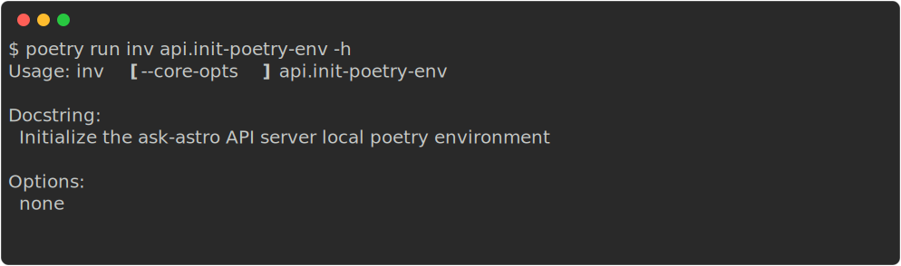
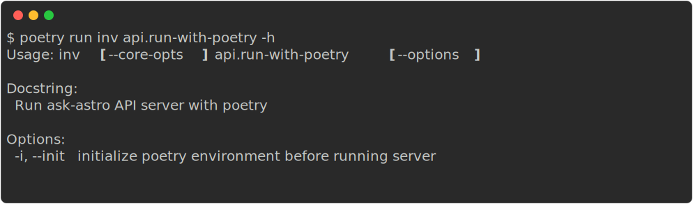
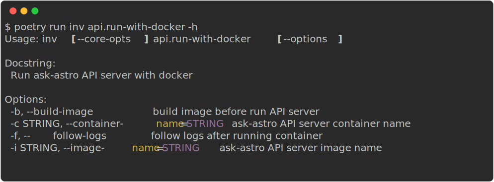
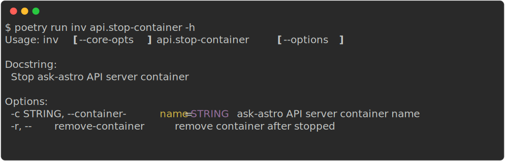

# Ask Astro Backend API

## Prerequisites

- Install [Docker](https://docs.docker.com/engine/install/)
- Access to Firestore
- Access to Langchain
- [Setup Local Development Tools](../local_development.md)

### Setup local development environment

Generate Env Variable template and add appropriate values

```bash
python3 scripts/local_dev.py api-env-template
```

#### Run with poetry
* Initialize the ask-astro API local poetry environment



* Run ask-astro API server with poetry



### Run with Docker

* Run ask-astro API server with docker



* Stop ask-astro API server container


