# Backend API CI/CD

Currently, we use [Google cloud run](https://cloud.google.com/run/docs/overview/what-is-cloud-run) to run API server,
and we deploy the backend API with [cloud build](https://cloud.google.com/build/docs/overview). You can find the cloud
build configuration [/api/cloudbuild.yaml](../../api/cloudbuild.yaml).

## Create cloud run service

1. Go to https://console.cloud.google.com/ and search for "cloud run" service.
2. On cloud run page click on "CREATE SERVICE"

3. Select "continuously deploy new revision from source repository" and "Set up with cloud build"
4. Select Repository provider as "GitHub" and click on next

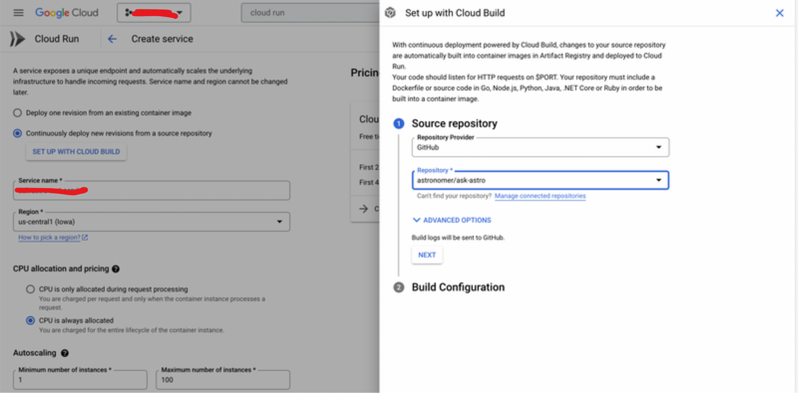

5. Set up build configuration
   1. Branch name: main
   2. Build type: Python via buildpacks
   3. build context directory: /api

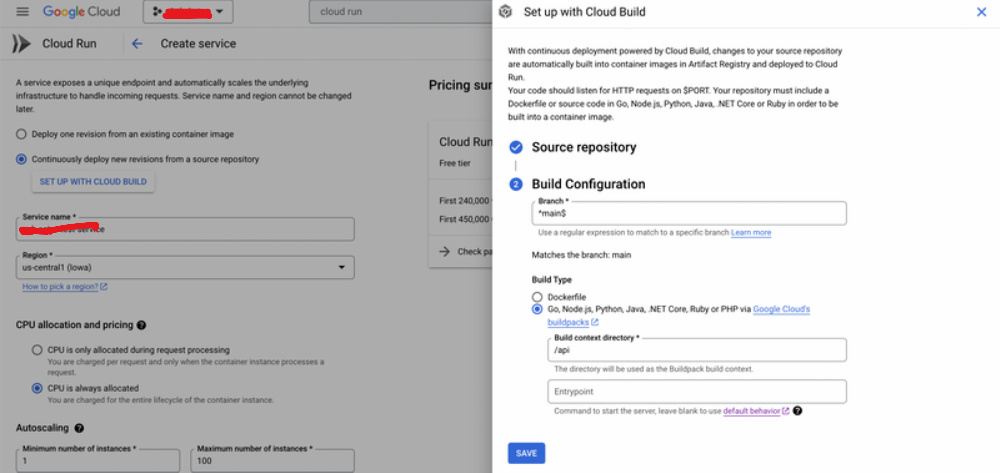

6. Add service name, region, CPU allocation and pricing, autoscaling, Ingress

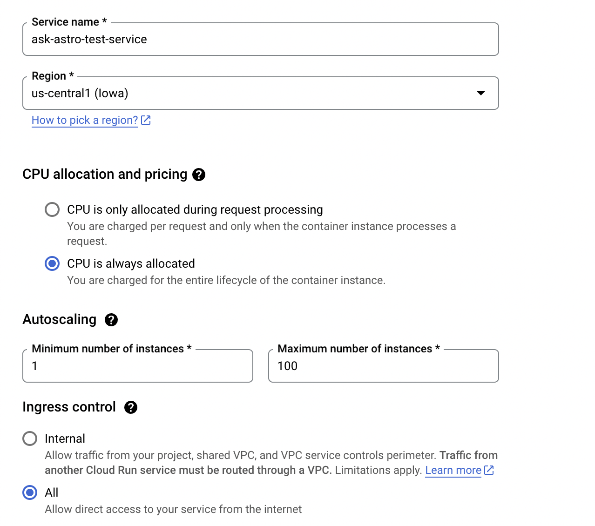

7. Allow unauthenticated invocation and click on create button

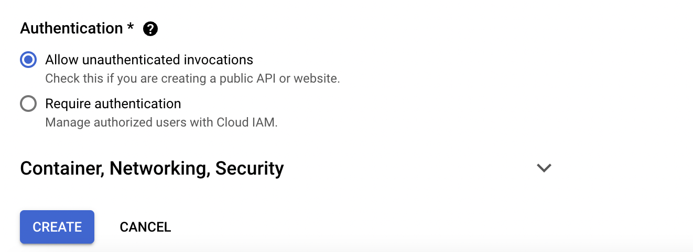

8. Add the Env variable that require to run backend API
   1. Once you create the service visit the created service page
   2. Click on "EDIT AND DEPLOY NEW REVISION"
   3. Add you Env variable and click on Deploy

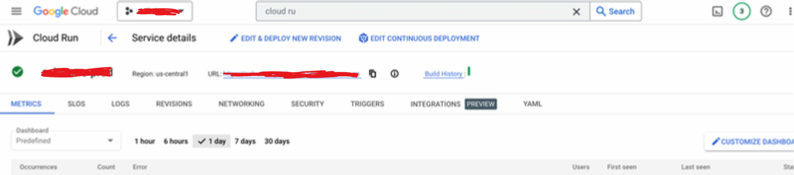

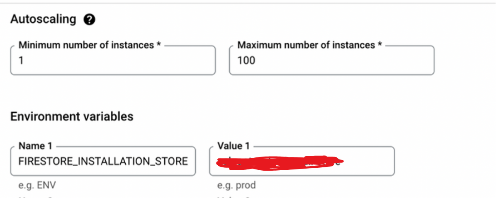

Above steps will create a cloud service and also template for cloud build

## Update cloud build configuration

1. Go to https://console.cloud.google.com/ and search for "cloud build" service.

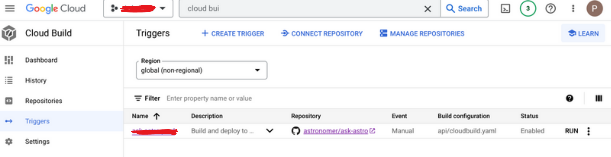

2. Click on "Triggers"
3. The previous steps will have already created a cloud trigger template for you which you can edit
4. Click on the cloud build trigger created in previous step update the
   1. Name, Description, Tag, Event as require
   2. Select source and branch
   3. Select "Cloud Build configuration file" in Configuration and Cloud Build configuration file location as "api/cloudbuild.yaml"
   4. Keep advance setting same and save it.

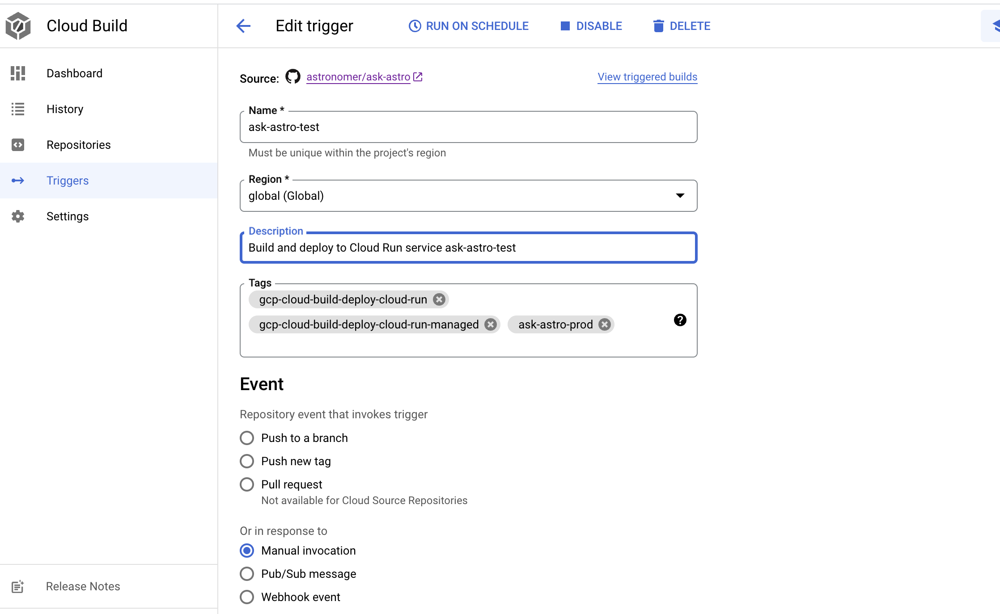

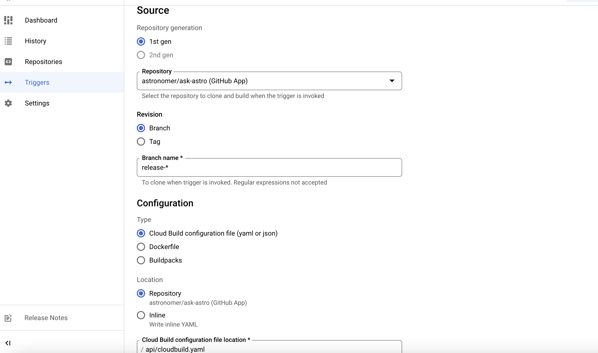

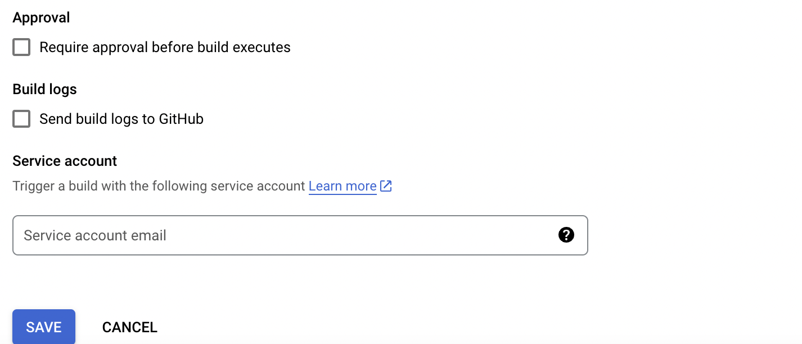

5. In setting enable cloud build and cloud run

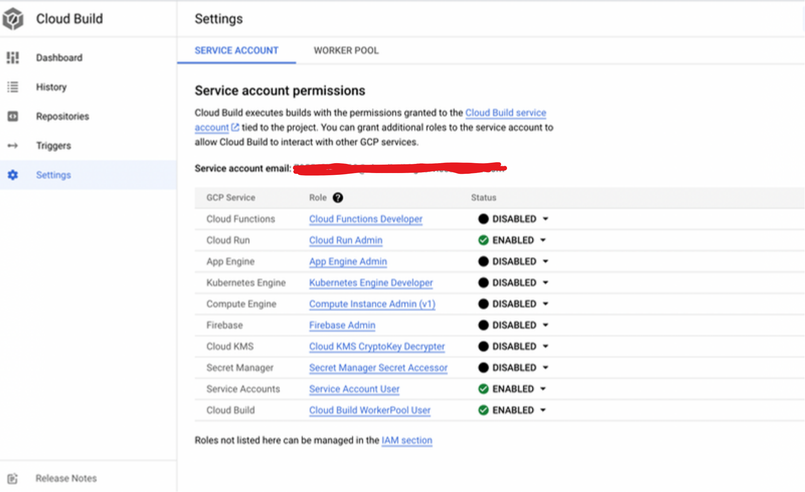
