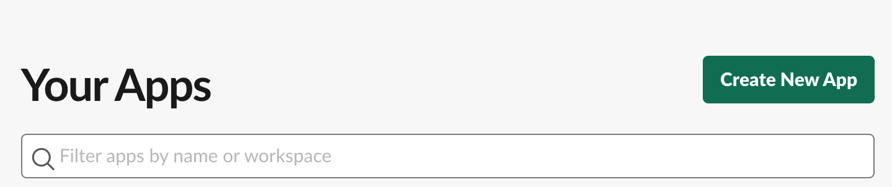
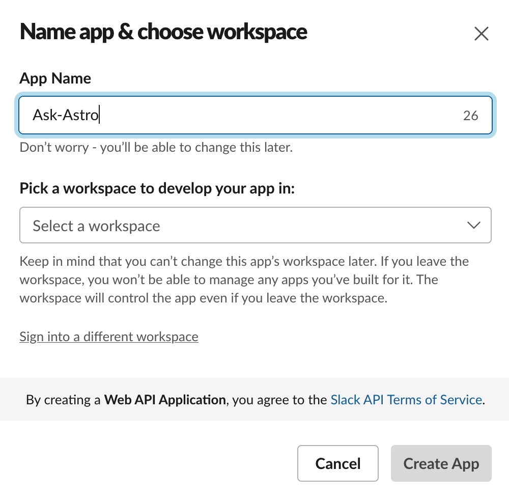
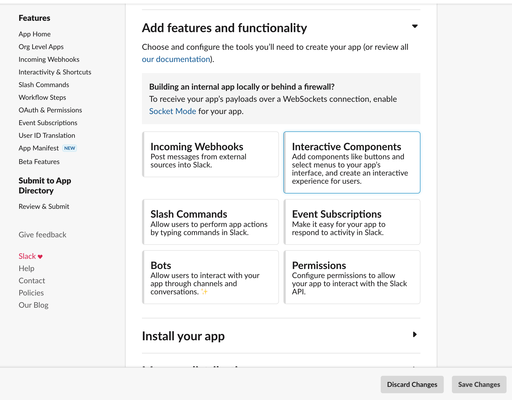
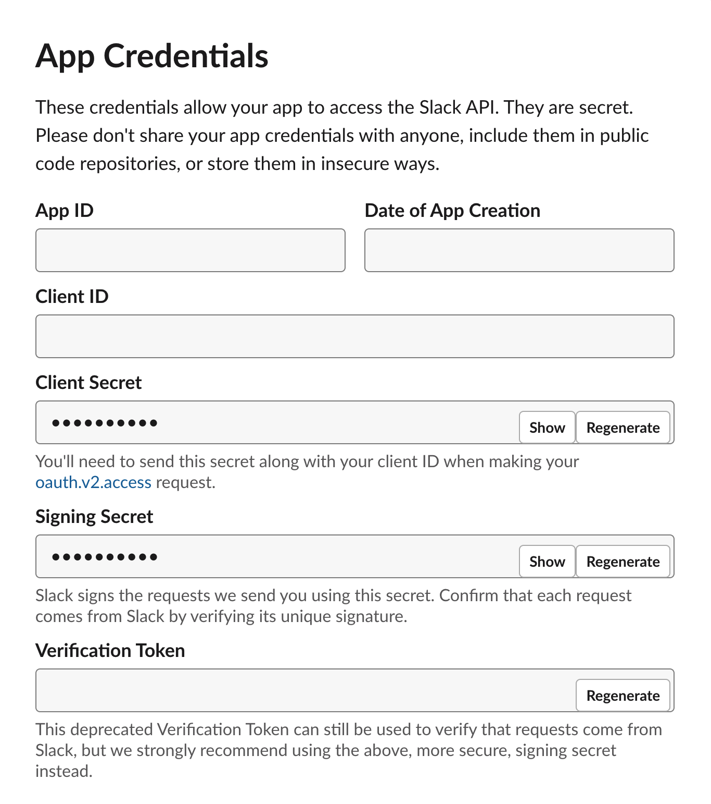
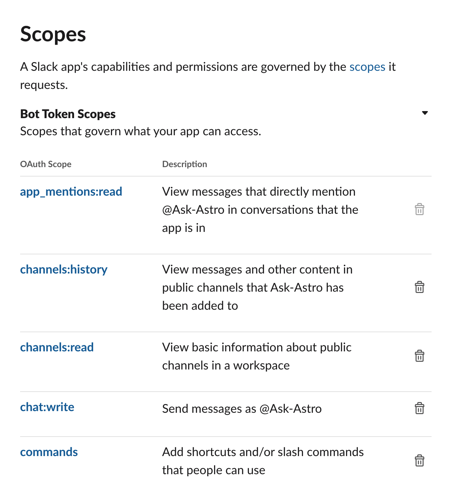
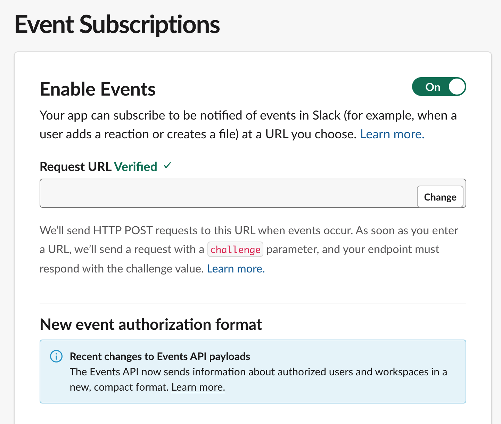
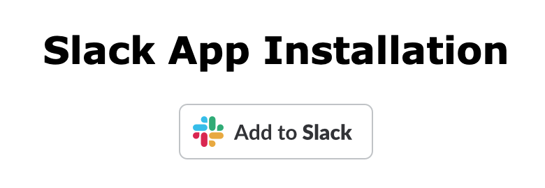

# Create an ask-astro Slack bot

1. Go to `https://api.slack.com/apps`.
2. Click **Create New Apps**.
    
3. On the **Create an app** page, click **From scratch**.
4. Name the app and pick a Slack workspace
    
    After creating the Slack app, Slack redirects you to the home page of this app.
    
5. Scroll down, to find the credentials for the ask-astro API backend
    
    * `SLACK_CLIENT_ID`: Client ID
    * `SLACK_CLIENT_SECRET`: Client Secret
    * `SLACK_SIGNING_SECRET`: Signing Secret
6. Start the ask-astro API backend by using a reachable host, such as [ngrok](https://ngrok.com/).
7. Go to the [OAuth & Permissions](https://api.slack.com/apps/<API_ID>/oauth?) page.
8. Add `https://<ask-astro api backend host>/slack/oauth_redirect` to **Redirect URLs**.
    
9. Add the following scopes.
    * commands
    * app_mentions:read
    * channels:read
    * channels:history
    * groups:read
    * groups:history
    * chat:write
    * reactions:read
    * reactions:write
    * users:read
    * users:read.email
    * team:read
    * im:history
    * mpim:history
    * files:read
    
10. Go to **Event Subscriptions** page for your App. (`https://api.slack.com/apps/<API_ID>/event-subscriptions?`)
11. Set **Request URL** to `https://<ask-astro api backend host>/slack/events`.
    
12. Go to the **Interactivity & Shortcuts** page.
13. Set **Request URL** to `https://<ask-astro api backend host>/slack/events`.
14. Go to `https://<ask-astro api backend host>/slack/install` and click **Add to Slack**.
    

The ask-astro bot is now available to use in your Slack work space!
