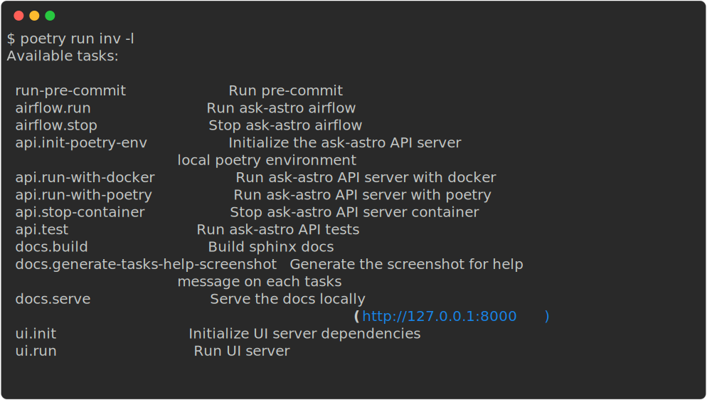

# Setup Local Development Tool

[TOC]

## Prerequisites

- [Python 3.11](https://www.python.org/downloads/release/python-3116/)
- [Install poetry](https://python-poetry.org/docs/#installation)


## Setup project root poetry envinroment for development tools

```sh
$ pwd

/.../ask-astro

$ python --version

Python 3.11.x

# install poetry (https://python-poetry.org/docs/#installation)
$ python -m pip install poetry
$ poetry install
```



### Documentation Tasks

- Build sphinx docs


- Serve the docs locally (http://127.0.0.1:8000)


- Generate the screenshot for help message on each tasks


### Airflow DAGs Tasks

- Run ask-astro airflow


- Stop ask-astro airflow


### Backend API Tasks

- Go to [Ask Astro Backend API](./api/README.md)

### UI Tasks

- Go to [Ask-Astro UI](./ui/README.md)


### Run linters

- Run pre-commit checks


