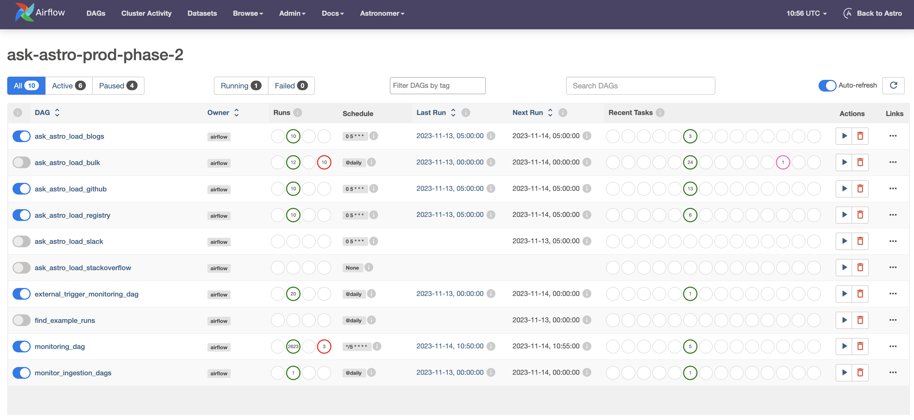
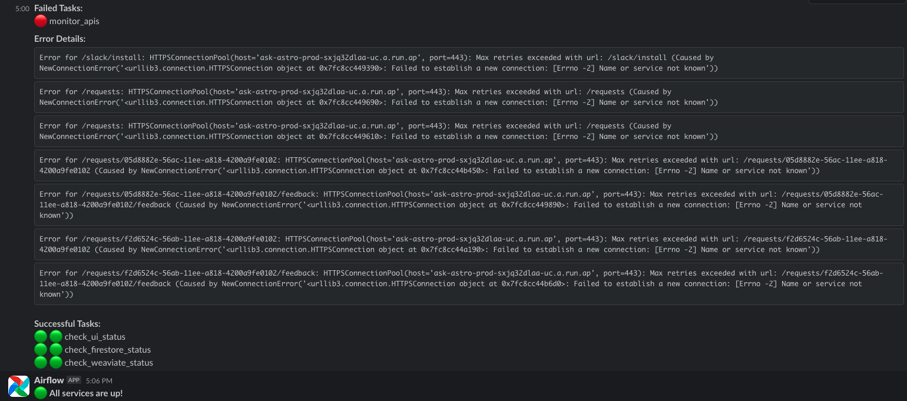
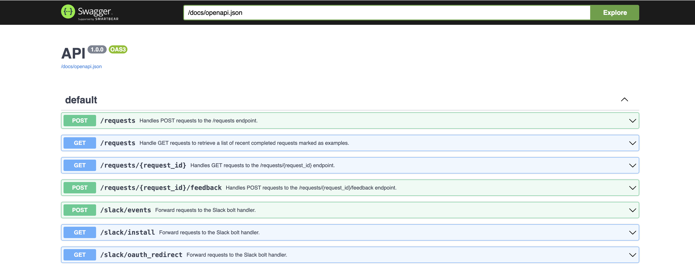
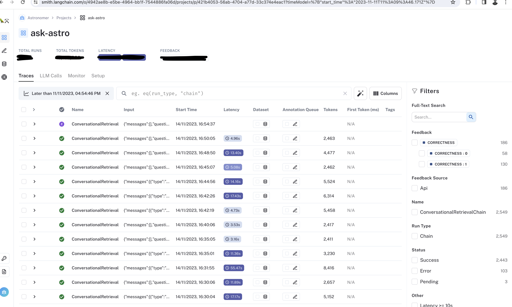
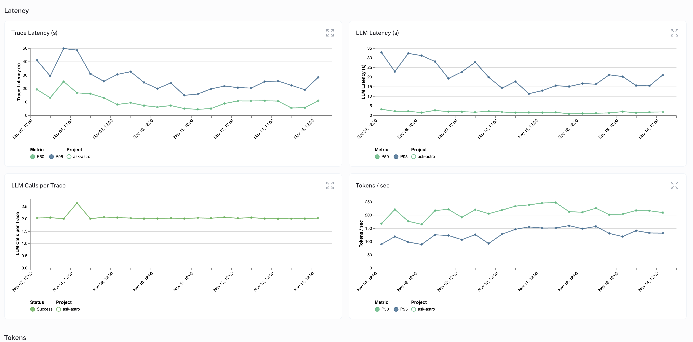

# Monitoring and Observability for Ask-Astro

## Overview

This document outlines the monitoring and observability practices implemented for Ask-Astro. These practices ensure the system's reliability and performance, as well as quick detection and resolution of issues. You can adapted them for similar systems requiring robust monitoring solutions.

## Infrastructure Monitoring

### Airflow DAGs

- **Monitoring DAG**: This [DAG](../airflow/dags/monitor/monitor.py) runs every 5 minutes to check the health of all infrastructure components.
- **Ingestion DAG Monitoring**: This [DAG](../airflow/dags/monitor/monitor_ingestion_dags.py) monitors the health of ingestion processes.

- 

### Alerting

- **Slack Integration**: In case of any failures, sends alerts to the designated Slack channel as DAGs run every 5 minutes. Regular status updates are also posted daily.

### Components Monitored

1. **APIs**: Back-end APIs are tested in sequence. Failure of any test results in an immediate alert.
  

2. **Google Firebase**: Monitors the Firestore app for its existence and health.

3. **Weaviate Database**: Ensures the presence of necessary classes and checks embedding counts.

4. **UI Monitoring**: Regular checks of the UI for a 200 response status.
   - UI Link: [https://ask.astronomer.io/](https://ask.astronomer.io/)

5. **Airflow Data Ingestion and Feedback DAGs**: Monitors for completeness and errors.

6. **Open AI Integration**: Ensures the availability and response quality of Open AI services.

## LLM Model Monitoring

Uses **Langsmith** or a similar AI monitoring platform for detailed insights into the LLM's performance.

### Aspects Monitored

1. **Usage Statistics**: Tracks query frequency, types, and usage patterns.

2. **Response Quality**: Evaluates accuracy, relevance, and helpfulness of LLM responses.

3. **User Feedback**: Collects and analyzes user feedback for continuous improvement.

4. **Volume Metrics**: Monitors trace counts, call counts, and success rates.

5. **Token Analysis**: Examines patterns in the model's responses.

6. **Error Rates**: Keeps track of model error rates to maintain reliability.

7. **Latency Metrics**: Measures response times for optimal user experience.

## Handling Failures

Document and follow detailed procedures for handling failures. These procedures should include the following
1. **Alerts**: Send alerts to the designated Slack channel for immediate attention.
2. **Error Logs**: Generate and store error logs for future reference.
3. **Error Resolution Documentation**: Document the error resolution process for future reference.
4. **Rolling back Deployment**: In case of a deployment failure, roll back to the previous version to ensure system availability.
5. **Point of Contact for each Component**: Designate a point of contact for each component to ensure quick resolution of issues.
6. **Update the user**: Notify the user of the issue and the expected resolution time.

## Conclusion

This monitoring setup is crucial for maintaining the operational efficiency and reliability of Ask-Astro. You can adapt and apply it to similar systems to ensure consistent performance and quick issue resolution.
