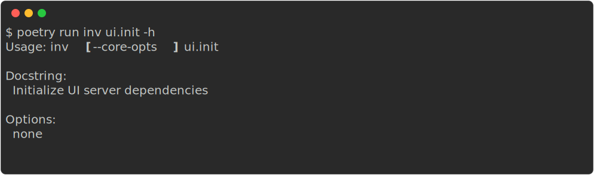
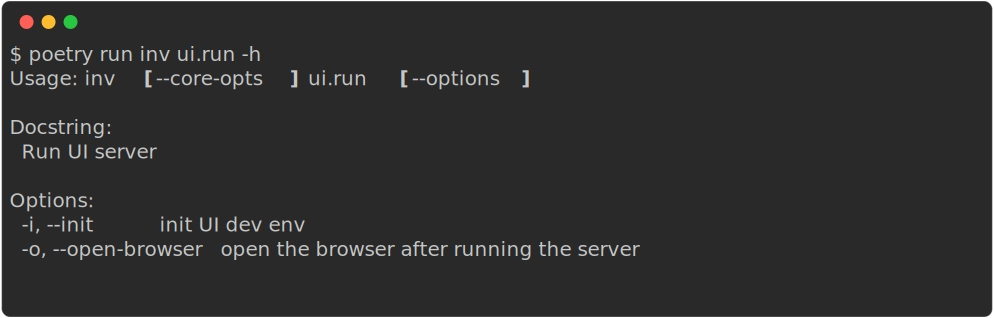

# Ask-Astro UI

## Developing

### Initialize UI server dependencies



### Run UI server

Add backend API sever url in `ui/.env` file

```bash
ASK_ASTRO_API_URL=http://0.0.0.0:8080
```

Run the development server:




## Building

To create a production version of your app:

```bash
npm run build
```

You can preview the production build with `npm run preview`.
